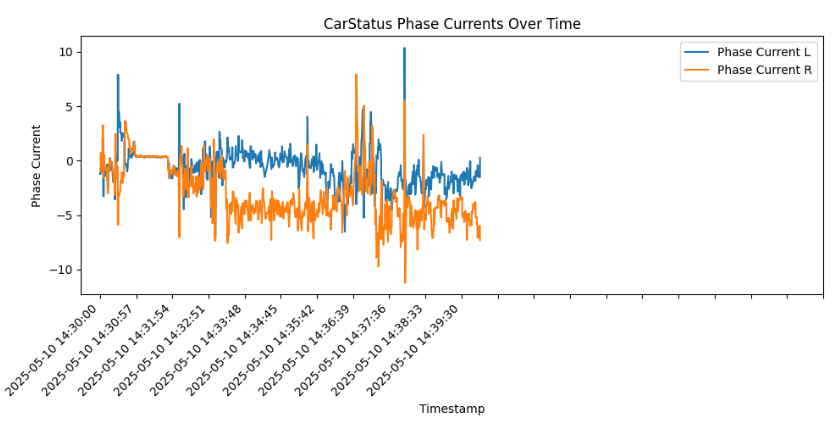

# bag_plot

This project helps visualize the data in a downloaded AutoXing bag file.

Its functionality is currently very limited and has been added only to meet customer needs.

It requires a ROS1 environment.

```
./plot.py --phase-current sample.bag 
```


